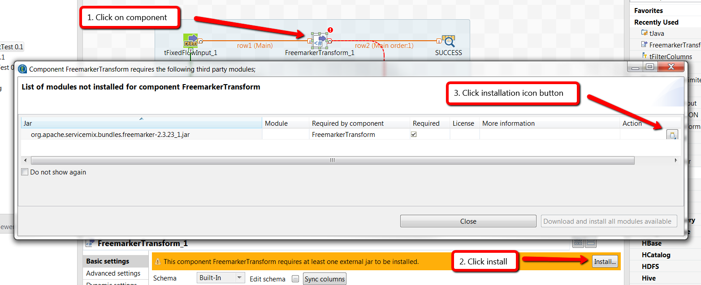
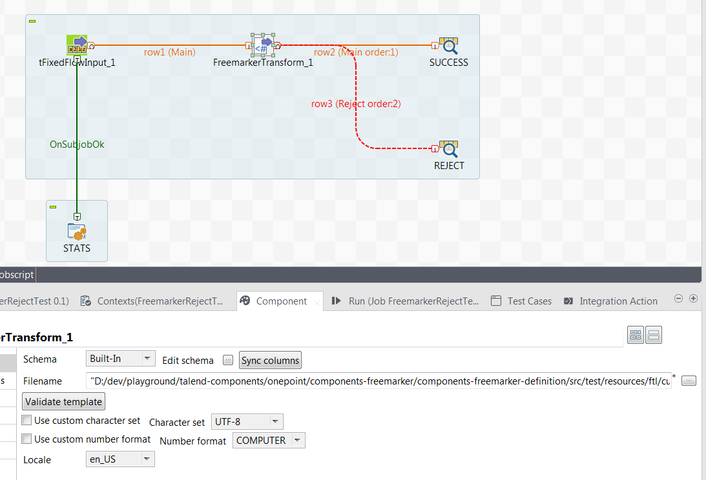

= Freemarker component
Gil Fernandes <gil.fernandes@onepointltd.com>
v1.0, 2018-04-11
:toc:
:imagesdir: .
:homepage: https://www.onepointltd.co,

== About
This component allows to generate text using Freemarker and Talend. This is a 
component which receives a record and applies a template to the data in the record 
producing a string internally using the https://freemarker.apache.org[Freemarker]
templating language.

== Target platform
This component was created for **Talend 6.5.1**, but can be easily made to run on
later versions of Talend.

== Compilation
The are the compilation steps:

- Run `mvn clean install` on the parent folder of this project.

The distributable zip file can be found in the folder <project-root>/components-freemarker-definition/target.
It typically has the name: 

`components-freemarker-definition-0.4.4-component-freemarker.zip`

== Installation

These are the installation steps:

- unzip the distributable file (e.g. `components-freemarker-definition-0.4.4-component-freemarker.zip`) to the installation folder
- In this installation folder you will find a file `components-freemarker-definition-0.4.4-bundle.jar`. 
  Copy this file to the plugins folder of your Talend Studio (e.g. `C:\talend\talend_6.5.1\studio\plugins`)
- Open the `config.ini` file located in the configuration folder of your Talend Studio with your favourite editor.
  The path is for example `D:\talend\talend_6.5.1\studio\configuration\config.ini`.
- Look for the `osgi.bundles` property. At the end of its value insert and comma and the name of the bundle jar file you have 
  copied into the plugins folder, followed by the string `@start`. So the extra text you should add
  to the `osgi.bundles` property should be e.g. `,components-freemarker-definition-0.4.4-bundle.jar@start`
- Now restart Talend Studio
- When you connect the component for the first time, it will ask you for additional libraries.
  These libraries can be found in the installation folder. These are the steps to follow when Talend
  asks for missing libraries:

== Example Jobs

Here are some example jobs:

